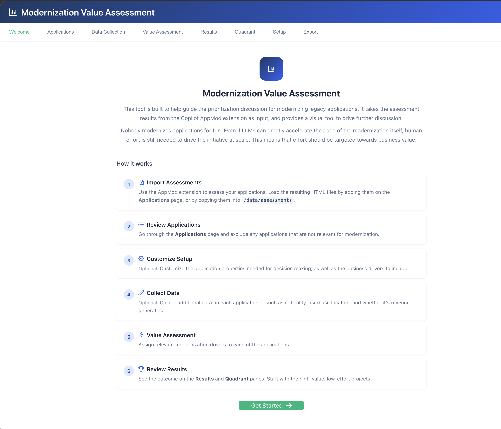

# Modernization Assessment Tool

An example web application for facilitating business value discussions in Application Modernization Programs at Scale. 

> [!WARNING]  
> This tool is meant to be run locally and should not be exposed to the internet. 
> It has no authentication or security features. 

## Quick Start (Docker)

```bash
mkdir -p data/assessments
docker compose up --build
```

Open [http://localhost:3000](http://localhost:3000).

## Screenshot



